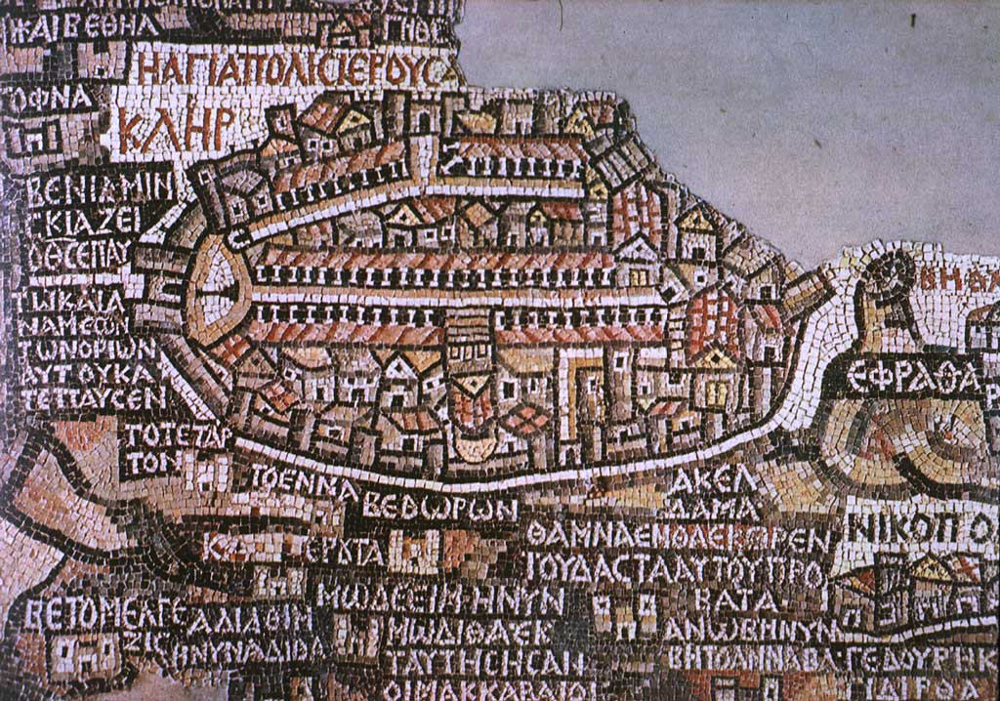
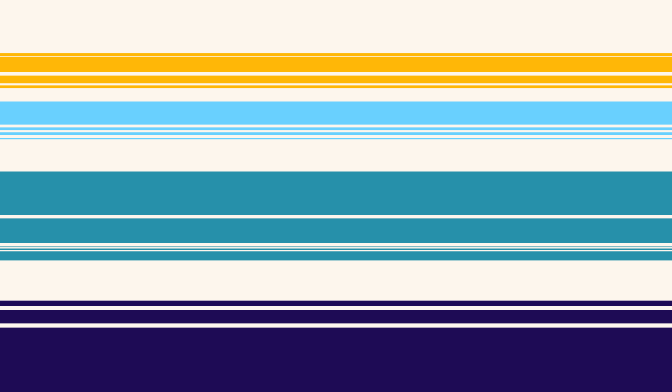
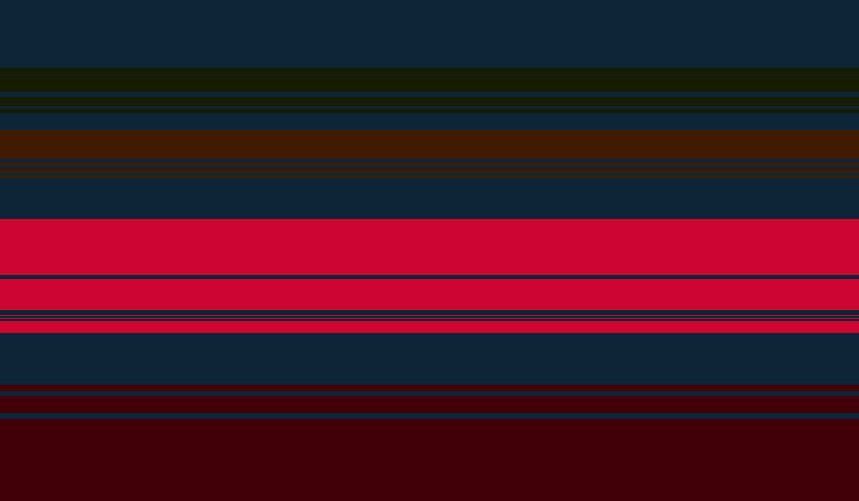

# `terraric`

An operating system of sorts, but more importantly, an apology.

## Etymology

As a hint of things to come, the name originally comes from a mixture of _terra_ and _mosaic_.
_terraic_ didn't sound right so I added an extra 'r', partly just to make the child inside of me who still loves dinosaurs happy.

## Identity

The visual identity of this project is still very much a work in progress.
That being said, I have come up with rough colour palettes for the light and dark themes.
I have no idea if they will actually work as themes though.

<table align="center">
  <tr>
    <td align="center">
       
      Light Mode
    </td>
    <td align="center">
       
      Dark Mode
    </td>
  </tr>
</table>

## Roadmap

Roadmaps are for people who plan to much.
I just want to play about with `three.js` and make something pretty.
